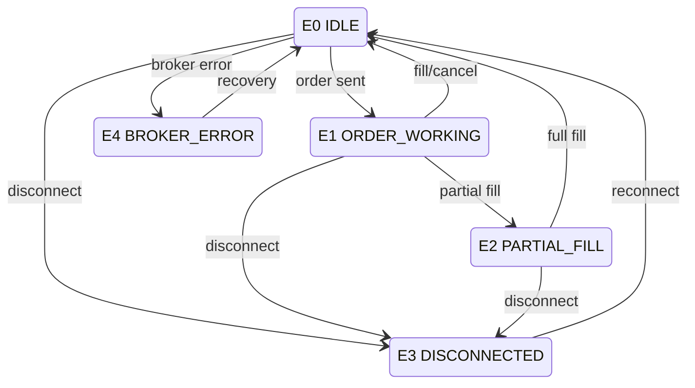
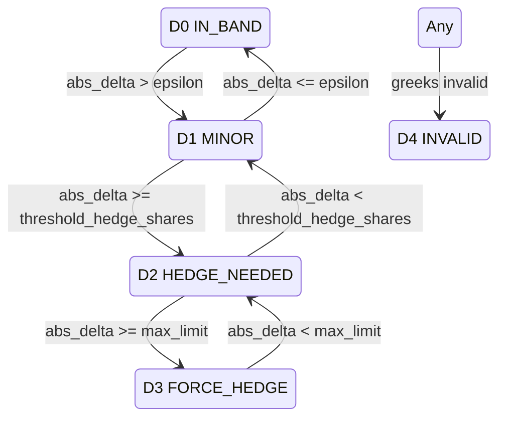
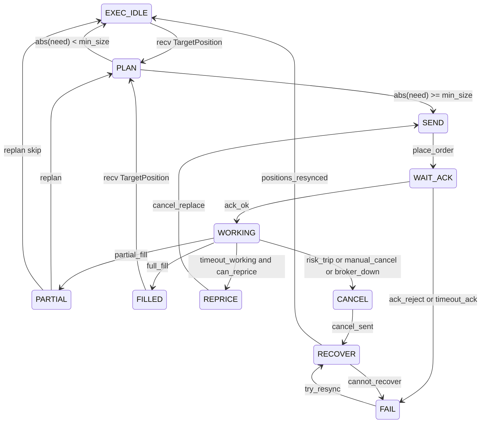

# 状态空间表与代码映射

本文档将 Gamma Scalping 的**状态空间**（六维 O、D、M、L、E、S）映射到代码位置、阈值配置，以及引擎何时输出 `TargetPosition`、何时进入 SAFE_MODE。

## 状态变量

| 变量 | 枚举 | 代码位置 | 说明 |
|------|------|----------|------|
| O | `OptionPositionState` | `src/core/state/enums.py` | 期权持仓 / gamma 符号 |
| D | `DeltaDeviationState` | `src/core/state/enums.py` | 净 delta 相对目标的偏离 |
| M | `MarketRegimeState` | `src/core/state/enums.py` | 市场状态（波动/趋势/缺口/陈旧） |
| L | `LiquidityState` | `src/core/state/enums.py` | 买卖价差 / 报价质量 |
| E | `ExecutionState` | `src/core/state/enums.py` | 订单/执行层状态 |
| S | `SystemHealthState` | `src/core/state/enums.py` | 系统健康（greeks、数据延迟、风控熔断） |

## 枚举取值

- **O**：`NONE` (O0)、`LONG_GAMMA` (O1)、`SHORT_GAMMA` (O2)
- **D**：`IN_BAND` (D0)、`MINOR` (D1)、`HEDGE_NEEDED` (D2)、`FORCE_HEDGE` (D3)、`INVALID` (D4)
- **M**：`QUIET` (M0)、`NORMAL` (M1)、`TREND` (M2)、`CHOPPY_HIGHVOL` (M3)、`GAP` (M4)、`STALE` (M5)
- **L**：`NORMAL` (L0)、`WIDE` (L1)、`EXTREME_WIDE` (L2)、`NO_QUOTE` (L3)
- **E**：`IDLE` (E0)、`ORDER_WORKING` (E1)、`PARTIAL_FILL` (E2)、`DISCONNECTED` (E3)、`BROKER_ERROR` (E4)
- **S**：`OK` (S0)、`GREEKS_BAD` (S1)、`DATA_LAG` (S2)、`RISK_HALT` (S3)

## 阈值配置与默认值

配置采用 **Option 2 (gates)**：在 `config/config.yaml` 的 `gates` 下按流水线对齐。

- **gates.strategy**：structure、earnings、trading_hours_only
- **gates.state**：delta (D)、market (M)、liquidity (L)、system (S)
- **gates.intent**：hedge（下单量、cooldown、min_price_move_pct）
- **gates.guard**：risk（熔断与每日限制）

（O 无配置，由持仓推导。）守护程序通过 `get_hedge_config(config)` 从 gates 读取并返回给 GsTrading、ExecutionGuard、gamma_scalper_intent 使用的扁平配置。兼容：仍支持顶层 `delta`、`hedge`、`risk`、`earnings` 及旧版 `state_space.*`。

| Section | Key | 默认值 | 说明 |
|---------|-----|--------|------|
| delta | epsilon_band | 10 | \|net_delta\| ≤ 此值 → D0 IN_BAND |
| delta | threshold_hedge_shares | 25 | \|net_delta\| ≥ 此值 → D2 HEDGE_NEEDED |
| delta | max_delta_limit | 500 | \|net_delta\| ≥ 此值 → D3 FORCE_HEDGE |
| market | vol_window_min | 5 | 波动/趋势所需最少 bar 数（简化） |
| market | stale_ts_threshold_ms | 5000 | 数据比此时间更旧 → M5 STALE |
| liquidity | wide_spread_pct | 0.1 | spread_pct ≥ 此值 → L1 WIDE |
| liquidity | extreme_spread_pct | 0.5 | spread_pct ≥ 此值 → L2 EXTREME_WIDE |
| system | data_lag_threshold_ms | 1000 | 延迟 > 此值 → S2 DATA_LAG |
| hedge | min_hedge_shares | 10 | 允许下单的最小数量 |
| hedge | min_price_move_pct | 0.2 | 最小价格变动百分比（门控） |
| hedge | cooldown_seconds | 60 | 两次对冲间隔（D3 可绕过） |
| hedge | max_hedge_shares_per_order | 500 | 单笔对冲最大股数 |

## 何时输出 TargetPosition 与何时进入 SAFE_MODE

- **输出目标 / 允许新对冲** 当：  
  `(O1 或 O2) 且 (D2 或 D3) 且 (L0 或 L1) 且 E0 且 S0`  
  逻辑：`src/strategy/hedge_gate.py` → `should_output_target(cs)`。

- **SAFE_MODE（不发起新对冲）** 当：  
  `L2 或 L3`（极端/无报价），或 `S1 或 S2 或 S3`（greeks 异常/数据延迟/风控熔断），或 `E3 或 E4`（断线/经纪错误）。  
  SAFE_MODE 下仅允许减仓等风险控制（若已实现）。

- **D3 FORCE_HEDGE**：会绕过 cooldown；`min_hedge_shares` 及保护性上限逻辑仍生效。  
  在 `apply_hedge_gates()` 中通过 `force_hedge` 传给 `ExecutionGuard.allow_hedge(..., force_hedge=True)`。

## 状态转换图 (Mermaid)

### 执行状态 (E)

### Delta 偏离 (D)

## Trading FSM（宏观）与 Hedge Execution FSM

引擎使用 **Trading FSM**（宏观状态）和 **Hedge Execution FSM**（执行子状态）。E (ExecutionState) 由 HedgeFSM 输出推导。

### Trading FSM 状态与事件

- **状态**：`BOOT`、`SYNC`、`IDLE`、`ARMED`、`MONITOR`、`NO_TRADE`、`PAUSE_COST`、`PAUSE_LIQ`、`NEED_HEDGE`、`HEDGING`、`SAFE`
- **事件**：`start`、`synced`、`tick`、`quote`、`greeks_update`、`target_emitted`、`hedge_done`、`hedge_failed`、`data_stale`、`greeks_bad`、`broker_down`、`broker_up`、`manual_resume`、`shutdown`
- **Trading FSM 门控**（`src/guards/trading_guard.py` 中的纯函数）：`data_ok`、`data_stale`、`greeks_bad`、`broker_down`、`have_option_position`、`delta_band_ready`、`in_no_trade_band`、`cost_ok`、`liquidity_ok`、`retry_allowed`、`exec_fault`

### Hedge Execution FSM 状态

- **状态**：`EXEC_IDLE`、`PLAN`、`SEND`、`WAIT_ACK`、`WORKING`、`PARTIAL`、`REPRICE`、`CANCEL`、`RECOVER`、`FILLED`、`FAIL`
- **E 映射**：EXEC_IDLE/FILLED → E0 IDLE；WORKING/WAIT_ACK/SEND/PLAN/REPRICE/CANCEL/RECOVER → E1 ORDER_WORKING；PARTIAL → E2 PARTIAL_FILL；FAIL（经纪）→ E4 BROKER_ERROR。

### StateSnapshot 与 Guards

- **StateSnapshot**（`src/core/state/snapshot.py`）：不可变世界状态，包含 O,D,M,L,E,S 及 spot、spread_pct、event_lag_ms、greeks、last_hedge_ts/price。由 CompositeState 经 `StateSnapshot.from_composite_state(cs, ...)` 构建。
- **Trading FSM guards**（`src/guards/trading_guard.py`）：TradingFSM 迁移逻辑使用的纯函数，可单独测试。**Hedge Execution FSM guard**（`src/guards/execution_guard.py`，`ExecutionGuard`）：由 `apply_hedge_gates()` 使用的下单前门控。

## 代码引用

- **CompositeState**：`src/core/state/composite.py` — 持有 O,D,M,L,E,S 及数值快照；`from_runtime()`、`update(event)`。
- **StateSnapshot**：`src/core/state/snapshot.py` — 供 guards 使用的不可变快照；`from_composite_state()`、`update(event)`。
- **StateClassifier**：`src/core/state/classifier.py` — `classify(...)` 将 position_book、market_data、greeks、execution 映射为 CompositeState。
- **Guards**：`src/guards/trading_guard.py` — Trading FSM 纯门控；`src/guards/execution_guard.py` — Hedge Execution FSM 的 ExecutionGuard（下单门控）。
- **Hedge gate**：`src/strategy/hedge_gate.py` — `should_output_target(cs)`、`apply_hedge_gates(intent, cs, guard)`。
- **Trading FSM**：`src/fsm/trading_fsm.py` — 宏观状态机；由事件与 guards 驱动的迁移表。
- **Hedge FSM**：`src/fsm/hedge_fsm.py` — 执行子 FSM；接收 TargetPosition，输出 E 状态。
- **OrderManager**：`src/execution/order_manager.py` — 当设置 `set_hedge_fsm()` 后，`effective_e_state()` 委托给 `HedgeFSM`（来自 `hedge_fsm`）。
