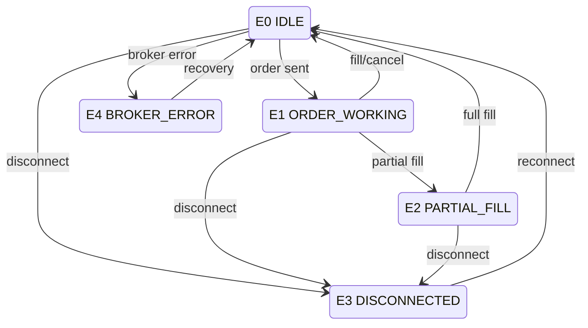
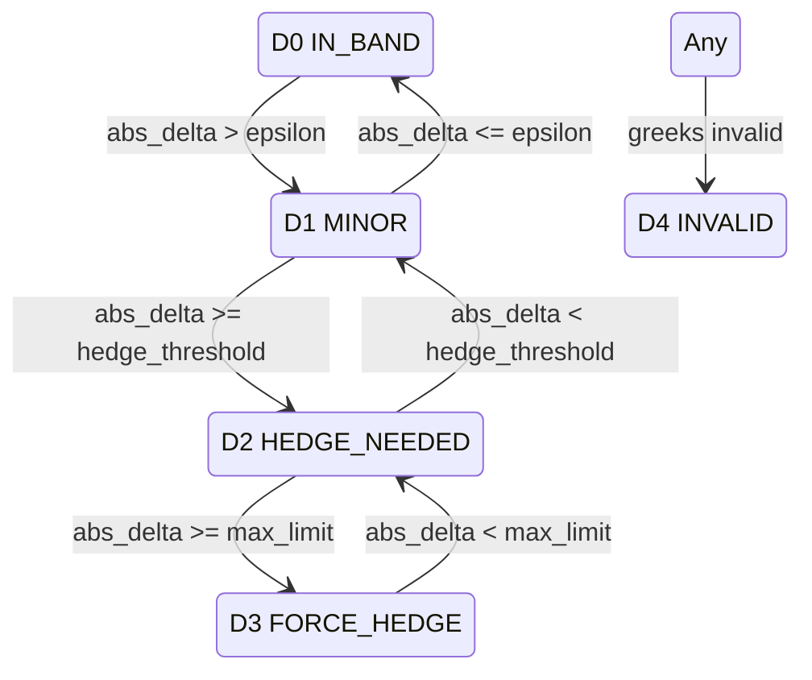
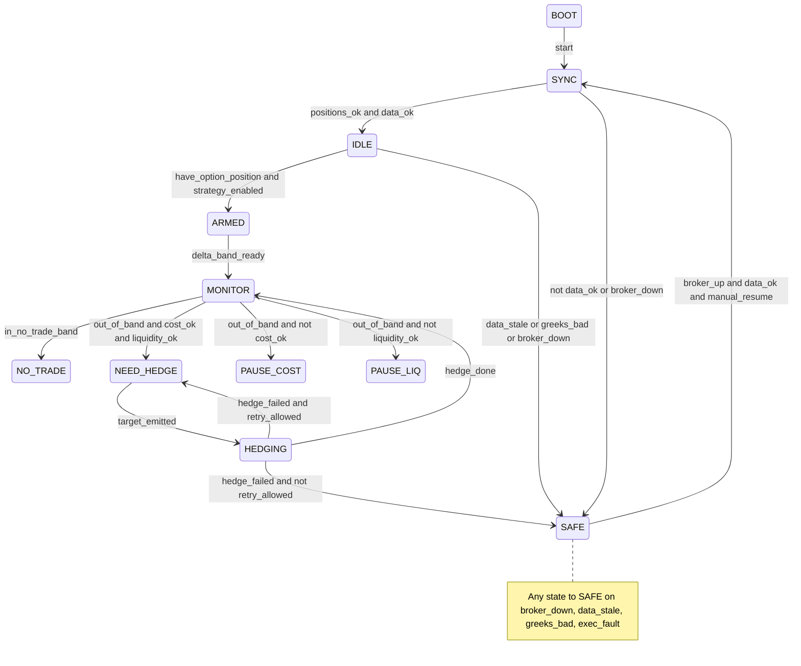
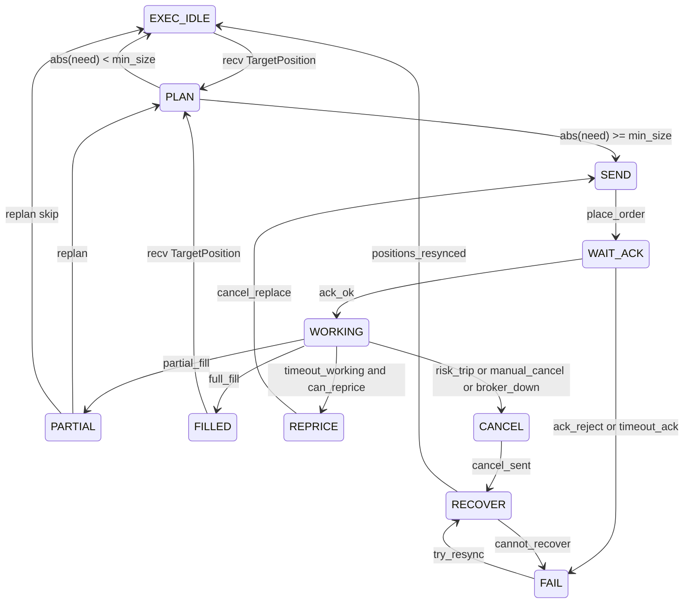

# State Space Table to Code Mapping

This document maps the Gamma Scalping **state space** (six dimensions O, D, M, L, E, S) to code locations, threshold config, and when the engine outputs `TargetPosition` vs enters SAFE_MODE.

## State Variables

| Variable | Enum | Code Location | Description |
|----------|------|----------------|--------------|
| O | `OptionPositionState` | `src/core/state/enums.py` | Option position / gamma sign |
| D | `DeltaDeviationState` | `src/core/state/enums.py` | Net delta deviation from target |
| M | `MarketRegimeState` | `src/core/state/enums.py` | Market regime (vol/trend/gap/stale) |
| L | `LiquidityState` | `src/core/state/enums.py` | Bid-ask spread / quote quality |
| E | `ExecutionState` | `src/core/state/enums.py` | Order/execution layer state |
| S | `SystemHealthState` | `src/core/state/enums.py` | System health (greeks, data lag, risk halt) |

## Enum Values

- **O**: `NONE` (O0), `LONG_GAMMA` (O1), `SHORT_GAMMA` (O2)
- **D**: `IN_BAND` (D0), `MINOR` (D1), `HEDGE_NEEDED` (D2), `FORCE_HEDGE` (D3), `INVALID` (D4)
- **M**: `QUIET` (M0), `NORMAL` (M1), `TREND` (M2), `CHOPPY_HIGHVOL` (M3), `GAP` (M4), `STALE` (M5)
- **L**: `NORMAL` (L0), `WIDE` (L1), `EXTREME_WIDE` (L2), `NO_QUOTE` (L3)
- **E**: `IDLE` (E0), `ORDER_WORKING` (E1), `PARTIAL_FILL` (E2), `DISCONNECTED` (E3), `BROKER_ERROR` (E4)
- **S**: `OK` (S0), `GREEKS_BAD` (S1), `DATA_LAG` (S2), `RISK_HALT` (S3)

## Threshold Config and Defaults

Config section: `state_space` in `config/config.yaml`. Typed defaults in `src/config/settings.py`.

| Section | Key | Default | Description |
|---------|-----|---------|-------------|
| delta | epsilon_band | 10 | \|net_delta\| ≤ this → D0 IN_BAND |
| delta | hedge_threshold | 25 | \|net_delta\| ≥ this → D2 HEDGE_NEEDED |
| delta | max_delta_limit | 500 | \|net_delta\| ≥ this → D3 FORCE_HEDGE |
| market | vol_window_min | 5 | Min bars for vol/trend (simplified) |
| market | stale_ts_threshold_ms | 5000 | Data older than this → M5 STALE |
| liquidity | wide_spread_pct | 0.1 | spread_pct ≥ this → L1 WIDE |
| liquidity | extreme_spread_pct | 0.5 | spread_pct ≥ this → L2 EXTREME_WIDE |
| system | data_lag_threshold_ms | 1000 | Lag > this → S2 DATA_LAG |
| hedge | min_hedge_shares | 10 | Minimum order size to allow |
| hedge | min_price_move_pct | 0.2 | Min price move % (gate) |
| hedge | cooldown_seconds | 60 | Cooldown between hedges (bypassed on D3) |

## When TargetPosition Is Output vs SAFE_MODE

- **Output target / allow new hedge** when:  
  `(O1 or O2) and (D2 or D3) and (L0 or L1) and E0 and S0`  
  Logic: `src/strategy/hedge_gate.py` → `should_output_target(cs)`.

- **SAFE_MODE (no new hedge)** when:  
  `L2 or L3` (extreme/no quote), or `S1 or S2 or S3` (greeks bad / data lag / risk halt), or `E3 or E4` (disconnected / broker error).  
  Only risk-reduction allowed in SAFE_MODE if implemented.

- **D3 FORCE_HEDGE**: Cooldown is bypassed; `min_hedge_shares` and protective limit logic still apply.  
  Applied in `apply_hedge_gates()` via `force_hedge` passed to `RiskGuard.allow_hedge(..., force_hedge=True)`.

## State Transition Diagrams (Mermaid)

### Execution State (E)

### Delta Deviation (D)

## Trading FSM (Macro) and Hedge Execution FSM

The engine uses a **Trading FSM** (macro states) and a **Hedge Execution FSM** (execution sub-states). E (ExecutionState) is derived from HedgeExecutionFSM output.

### Trading FSM States and Events

- **States**: `BOOT`, `SYNC`, `IDLE`, `ARMED`, `MONITOR`, `NO_TRADE`, `PAUSE_COST`, `PAUSE_LIQ`, `NEED_HEDGE`, `HEDGING`, `SAFE`
- **Events**: `start`, `synced`, `tick`, `quote`, `greeks_update`, `target_emitted`, `hedge_done`, `hedge_failed`, `data_stale`, `greeks_bad`, `broker_down`, `broker_up`, `manual_resume`, `shutdown`
- **Guards** (pure functions in `src/core/state/guards.py`): `data_ok`, `data_stale`, `greeks_bad`, `broker_down`, `have_option_position`, `delta_band_ready`, `in_no_trade_band`, `out_of_band`, `cost_ok`, `liquidity_ok`, `retry_allowed`, `exec_fault`

### Hedge Execution FSM States

- **States**: `EXEC_IDLE`, `PLAN`, `SEND`, `WAIT_ACK`, `WORKING`, `PARTIAL`, `REPRICE`, `CANCEL`, `RECOVER`, `FILLED`, `FAIL`
- **E mapping**: EXEC_IDLE/FILLED → E0 IDLE; WORKING/WAIT_ACK/SEND/PLAN/REPRICE/CANCEL/RECOVER → E1 ORDER_WORKING; PARTIAL → E2 PARTIAL_FILL; FAIL (broker) → E4 BROKER_ERROR.

### StateSnapshot and Guards

- **StateSnapshot** (`src/core/state/snapshot.py`): Immutable world state with O,D,M,L,E,S plus spot, spread_pct, event_lag_ms, greeks, last_hedge_ts/price. Built from CompositeState via `StateSnapshot.from_composite_state(cs, ...)`.
- **Guards** (`src/core/state/guards.py`): Pure functions used by TradingFSM transition logic; all testable in isolation.

## Code References

- **CompositeState**: `src/core/state/composite.py` — holds O,D,M,L,E,S and numeric snapshots; `from_runtime()`, `update(event)`.
- **StateSnapshot**: `src/core/state/snapshot.py` — immutable snapshot for guards; `from_composite_state()`, `update(event)`.
- **StateClassifier**: `src/core/state/classifier.py` — `classify(...)` maps position_book, market_data, greeks, execution → CompositeState.
- **Guards**: `src/core/state/guards.py` — pure guard functions for FSM transitions.
- **Hedge gate**: `src/strategy/hedge_gate.py` — `should_output_target(cs)`, `apply_hedge_gates(intent, cs, guard)`.
- **Trading FSM**: `src/fsm/trading_fsm.py` — macro state machine; transition table driven by events and guards.
- **Hedge Execution FSM**: `src/fsm/hedge_execution_fsm.py` — execution sub-FSM; receives TargetPosition, outputs E state.
- **Execution FSM** (legacy): `src/execution/execution_fsm.py` — E transitions when HedgeExecutionFSM not used; `can_place_order()` blocks duplicate orders when E1/E2.
- **OrderManager**: `src/execution/order_manager.py` — when `set_hedge_execution_fsm()` is set, `effective_e_state()` delegates to HedgeExecutionFSM.
