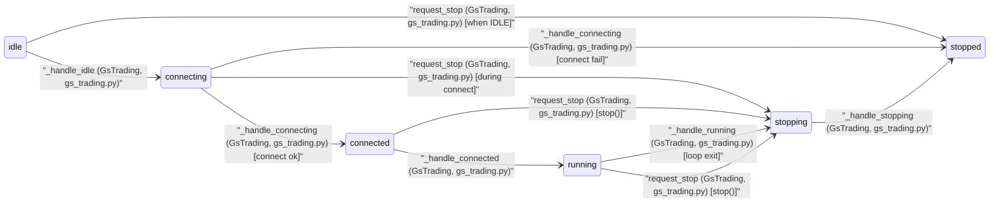

# Daemon FSM

DaemonState and `transition` + caller in `DaemonFSM` (src/fsm/daemon_fsm.py).
Callers in `GsTrading` (src/app/gs_trading.py).

## State Diagram

[Open in browser](../fsm_daemon_diagram.html) — zoomable standalone HTML

## Transition Table

| from_state | to_state | method | class | file | condition |
|------------|----------|--------|-------|------|----------|
| connected | running | _handle_connected | GsTrading | src/app/gs_trading.py |  |
| connected | stopping | request_stop | GsTrading | src/app/gs_trading.py | stop() |
| connecting | connected | _handle_connecting | GsTrading | src/app/gs_trading.py | connect ok |
| connecting | stopped | _handle_connecting | GsTrading | src/app/gs_trading.py | connect fail |
| connecting | stopping | request_stop | GsTrading | src/app/gs_trading.py | during connect |
| idle | connecting | _handle_idle | GsTrading | src/app/gs_trading.py |  |
| idle | stopped | request_stop | GsTrading | src/app/gs_trading.py | when IDLE |
| running | stopping | _handle_running | GsTrading | src/app/gs_trading.py | loop exit |
| running | stopping | request_stop | GsTrading | src/app/gs_trading.py | stop() |
| stopping | stopped | _handle_stopping | GsTrading | src/app/gs_trading.py |  |
