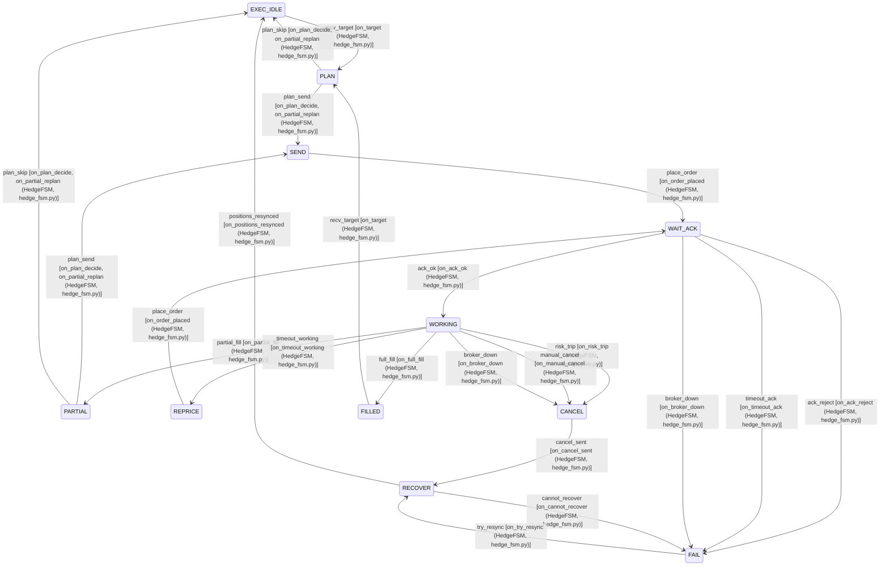

# Hedge FSM

HedgeState, HedgeEvent, and `on_*` methods in `HedgeFSM` (src/fsm/hedge_fsm.py).

## State Diagram

[Open in browser](../fsm_hedge_diagram.html) — zoomable standalone HTML

## Transition Table

| on_method | class | file | from_state | event | to_state |
|-----------|-------|------|------------|-------|----------|
| on_cancel_sent | HedgeFSM | src/fsm/hedge_fsm.py | CANCEL | cancel_sent | RECOVER |
| on_target | HedgeFSM | src/fsm/hedge_fsm.py | EXEC_IDLE | recv_target | PLAN |
| on_try_resync | HedgeFSM | src/fsm/hedge_fsm.py | FAIL | try_resync | RECOVER |
| on_target | HedgeFSM | src/fsm/hedge_fsm.py | FILLED | recv_target | PLAN |
| on_plan_decide, on_partial_replan | HedgeFSM | src/fsm/hedge_fsm.py | PARTIAL | plan_send | SEND |
| on_plan_decide, on_partial_replan | HedgeFSM | src/fsm/hedge_fsm.py | PARTIAL | plan_skip | EXEC_IDLE |
| on_plan_decide, on_partial_replan | HedgeFSM | src/fsm/hedge_fsm.py | PLAN | plan_send | SEND |
| on_plan_decide, on_partial_replan | HedgeFSM | src/fsm/hedge_fsm.py | PLAN | plan_skip | EXEC_IDLE |
| on_cannot_recover | HedgeFSM | src/fsm/hedge_fsm.py | RECOVER | cannot_recover | FAIL |
| on_positions_resynced | HedgeFSM | src/fsm/hedge_fsm.py | RECOVER | positions_resynced | EXEC_IDLE |
| on_order_placed | HedgeFSM | src/fsm/hedge_fsm.py | REPRICE | place_order | WAIT_ACK |
| on_order_placed | HedgeFSM | src/fsm/hedge_fsm.py | SEND | place_order | WAIT_ACK |
| on_ack_ok | HedgeFSM | src/fsm/hedge_fsm.py | WAIT_ACK | ack_ok | WORKING |
| on_ack_reject | HedgeFSM | src/fsm/hedge_fsm.py | WAIT_ACK | ack_reject | FAIL |
| on_broker_down | HedgeFSM | src/fsm/hedge_fsm.py | WAIT_ACK | broker_down | FAIL |
| on_timeout_ack | HedgeFSM | src/fsm/hedge_fsm.py | WAIT_ACK | timeout_ack | FAIL |
| on_broker_down | HedgeFSM | src/fsm/hedge_fsm.py | WORKING | broker_down | CANCEL |
| on_full_fill | HedgeFSM | src/fsm/hedge_fsm.py | WORKING | full_fill | FILLED |
| on_manual_cancel | HedgeFSM | src/fsm/hedge_fsm.py | WORKING | manual_cancel | CANCEL |
| on_partial_fill | HedgeFSM | src/fsm/hedge_fsm.py | WORKING | partial_fill | PARTIAL |
| on_risk_trip | HedgeFSM | src/fsm/hedge_fsm.py | WORKING | risk_trip | CANCEL |
| on_timeout_working | HedgeFSM | src/fsm/hedge_fsm.py | WORKING | timeout_working | REPRICE |
