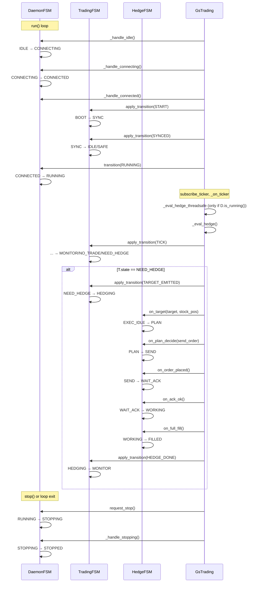

# FSM Linkage: Daemon ↔ Trading ↔ Hedge

Sequence diagram showing how the three FSMs interact. See [FSM Linkage (detailed)](FSM_LINKAGE.md) for full explanation.

## Sequence Diagram

[Open in browser](../fsm_linkage_diagram.html) — zoomable standalone HTML

