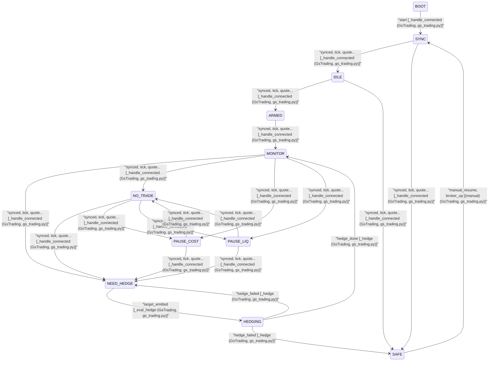

# Trading FSM

TradingState, TradingEvent, and `apply_transition` + caller in `TradingFSM` (src/fsm/trading_fsm.py).
Callers in `GsTrading` (src/app/gs_trading.py).

!!! note
    Any state → SAFE when `broker_down | data_stale | greeks_bad | exec_fault`.

## State Diagram

[Open in browser](../fsm_trading_diagram.html) — zoomable standalone HTML

## Transition Table

The table below lists **every possible transition** the Trading FSM can take. It is **manually authored** in `scripts/fsm_trading_diagram.py` as `TRADING_TRANSITIONS` and kept in sync with the runtime logic in `src/fsm/trading_fsm.py`.

- **One row** = one (from_state, event, to_state) with the **guard** that selects that outcome.
- The same (from_state, event) can appear in **multiple rows** with different (to_state, guard), because the handler evaluates guards in order and picks one next state (e.g. from MONITOR, event TICK → NO_TRADE if `in_no_trade_band`, else NEED_HEDGE if cost and liquidity OK, else PAUSE_COST or PAUSE_LIQ).
- **Why so many rows?** States like MONITOR, NO_TRADE, PAUSE_COST, PAUSE_LIQ all react to the same four events (SYNCED, TICK, QUOTE, GREEKS_UPDATE), and each (state, event) can lead to several next states depending on guards — so we get 4 events × 4 outcomes per state, plus IDLE/SYNC/ARMED/NEED_HEDGE/HEDGING/SAFE transitions.

| from_state | event | to_state | guard | caller | class | file |
|------------|-------|----------|-------|--------|-------|------|
| ARMED | greeks_update | MONITOR | delta_band_ready | _eval_hedge | GsTrading | src/app/gs_trading.py |
| ARMED | quote | MONITOR | delta_band_ready | _eval_hedge | GsTrading | src/app/gs_trading.py |
| ARMED | synced | MONITOR | delta_band_ready | _handle_connected | GsTrading | src/app/gs_trading.py |
| ARMED | tick | MONITOR | delta_band_ready | _eval_hedge | GsTrading | src/app/gs_trading.py |
| BOOT | start | SYNC |  | _handle_connected | GsTrading | src/app/gs_trading.py |
| HEDGING | hedge_done | MONITOR |  | _hedge | GsTrading | src/app/gs_trading.py |
| HEDGING | hedge_failed | NEED_HEDGE | retry_allowed | _hedge | GsTrading | src/app/gs_trading.py |
| HEDGING | hedge_failed | SAFE | !retry_allowed | _hedge | GsTrading | src/app/gs_trading.py |
| IDLE | greeks_update | ARMED | have_option or strategy_enabled | _eval_hedge | GsTrading | src/app/gs_trading.py |
| IDLE | greeks_update | SAFE | data_stale or greeks_bad or broker_down | _eval_hedge | GsTrading | src/app/gs_trading.py |
| IDLE | quote | ARMED | have_option or strategy_enabled | _eval_hedge | GsTrading | src/app/gs_trading.py |
| IDLE | quote | SAFE | data_stale or greeks_bad or broker_down | _eval_hedge | GsTrading | src/app/gs_trading.py |
| IDLE | synced | ARMED | have_option or strategy_enabled | _handle_connected | GsTrading | src/app/gs_trading.py |
| IDLE | synced | SAFE | data_stale or greeks_bad or broker_down | _handle_connected | GsTrading | src/app/gs_trading.py |
| IDLE | tick | ARMED | have_option or strategy_enabled | _eval_hedge | GsTrading | src/app/gs_trading.py |
| IDLE | tick | SAFE | data_stale or greeks_bad or broker_down | _eval_hedge | GsTrading | src/app/gs_trading.py |
| MONITOR | greeks_update | NEED_HEDGE | !in_no_trade_band & cost_ok & liq_ok | _eval_hedge | GsTrading | src/app/gs_trading.py |
| MONITOR | greeks_update | NO_TRADE | in_no_trade_band | _eval_hedge | GsTrading | src/app/gs_trading.py |
| MONITOR | greeks_update | PAUSE_COST | !in_no_trade_band & !cost_ok | _eval_hedge | GsTrading | src/app/gs_trading.py |
| MONITOR | greeks_update | PAUSE_LIQ | !in_no_trade_band & !liq_ok | _eval_hedge | GsTrading | src/app/gs_trading.py |
| MONITOR | quote | NEED_HEDGE | !in_no_trade_band & cost_ok & liq_ok | _eval_hedge | GsTrading | src/app/gs_trading.py |
| MONITOR | quote | NO_TRADE | in_no_trade_band | _eval_hedge | GsTrading | src/app/gs_trading.py |
| MONITOR | quote | PAUSE_COST | !in_no_trade_band & !cost_ok | _eval_hedge | GsTrading | src/app/gs_trading.py |
| MONITOR | quote | PAUSE_LIQ | !in_no_trade_band & !liq_ok | _eval_hedge | GsTrading | src/app/gs_trading.py |
| MONITOR | synced | NEED_HEDGE | !in_no_trade_band & cost_ok & liq_ok | _handle_connected | GsTrading | src/app/gs_trading.py |
| MONITOR | synced | NO_TRADE | in_no_trade_band | _handle_connected | GsTrading | src/app/gs_trading.py |
| MONITOR | synced | PAUSE_COST | !in_no_trade_band & !cost_ok | _handle_connected | GsTrading | src/app/gs_trading.py |
| MONITOR | synced | PAUSE_LIQ | !in_no_trade_band & !liq_ok | _handle_connected | GsTrading | src/app/gs_trading.py |
| MONITOR | tick | NEED_HEDGE | !in_no_trade_band & cost_ok & liq_ok | _eval_hedge | GsTrading | src/app/gs_trading.py |
| MONITOR | tick | NO_TRADE | in_no_trade_band | _eval_hedge | GsTrading | src/app/gs_trading.py |
| MONITOR | tick | PAUSE_COST | !in_no_trade_band & !cost_ok | _eval_hedge | GsTrading | src/app/gs_trading.py |
| MONITOR | tick | PAUSE_LIQ | !in_no_trade_band & !liq_ok | _eval_hedge | GsTrading | src/app/gs_trading.py |
| NEED_HEDGE | target_emitted | HEDGING |  | _eval_hedge | GsTrading | src/app/gs_trading.py |
| NO_TRADE | greeks_update | NEED_HEDGE | !in_no_trade_band & cost_ok & liq_ok | _eval_hedge | GsTrading | src/app/gs_trading.py |
| NO_TRADE | greeks_update | PAUSE_COST | !in_no_trade_band & !cost_ok | _eval_hedge | GsTrading | src/app/gs_trading.py |
| NO_TRADE | greeks_update | PAUSE_LIQ | !in_no_trade_band & !liq_ok | _eval_hedge | GsTrading | src/app/gs_trading.py |
| NO_TRADE | quote | NEED_HEDGE | !in_no_trade_band & cost_ok & liq_ok | _eval_hedge | GsTrading | src/app/gs_trading.py |
| NO_TRADE | quote | PAUSE_COST | !in_no_trade_band & !cost_ok | _eval_hedge | GsTrading | src/app/gs_trading.py |
| NO_TRADE | quote | PAUSE_LIQ | !in_no_trade_band & !liq_ok | _eval_hedge | GsTrading | src/app/gs_trading.py |
| NO_TRADE | synced | NEED_HEDGE | !in_no_trade_band & cost_ok & liq_ok | _handle_connected | GsTrading | src/app/gs_trading.py |
| NO_TRADE | synced | PAUSE_COST | !in_no_trade_band & !cost_ok | _handle_connected | GsTrading | src/app/gs_trading.py |
| NO_TRADE | synced | PAUSE_LIQ | !in_no_trade_band & !liq_ok | _handle_connected | GsTrading | src/app/gs_trading.py |
| NO_TRADE | tick | NEED_HEDGE | !in_no_trade_band & cost_ok & liq_ok | _eval_hedge | GsTrading | src/app/gs_trading.py |
| NO_TRADE | tick | PAUSE_COST | !in_no_trade_band & !cost_ok | _eval_hedge | GsTrading | src/app/gs_trading.py |
| NO_TRADE | tick | PAUSE_LIQ | !in_no_trade_band & !liq_ok | _eval_hedge | GsTrading | src/app/gs_trading.py |
| PAUSE_COST | greeks_update | NEED_HEDGE | !in_no_trade_band & cost_ok & liq_ok | _eval_hedge | GsTrading | src/app/gs_trading.py |
| PAUSE_COST | greeks_update | NO_TRADE | in_no_trade_band | _eval_hedge | GsTrading | src/app/gs_trading.py |
| PAUSE_COST | quote | NEED_HEDGE | !in_no_trade_band & cost_ok & liq_ok | _eval_hedge | GsTrading | src/app/gs_trading.py |
| PAUSE_COST | quote | NO_TRADE | in_no_trade_band | _eval_hedge | GsTrading | src/app/gs_trading.py |
| PAUSE_COST | synced | NEED_HEDGE | !in_no_trade_band & cost_ok & liq_ok | _handle_connected | GsTrading | src/app/gs_trading.py |
| PAUSE_COST | synced | NO_TRADE | in_no_trade_band | _handle_connected | GsTrading | src/app/gs_trading.py |
| PAUSE_COST | tick | NEED_HEDGE | !in_no_trade_band & cost_ok & liq_ok | _eval_hedge | GsTrading | src/app/gs_trading.py |
| PAUSE_COST | tick | NO_TRADE | in_no_trade_band | _eval_hedge | GsTrading | src/app/gs_trading.py |
| PAUSE_LIQ | greeks_update | NEED_HEDGE | !in_no_trade_band & cost_ok & liq_ok | _eval_hedge | GsTrading | src/app/gs_trading.py |
| PAUSE_LIQ | greeks_update | NO_TRADE | in_no_trade_band | _eval_hedge | GsTrading | src/app/gs_trading.py |
| PAUSE_LIQ | quote | NEED_HEDGE | !in_no_trade_band & cost_ok & liq_ok | _eval_hedge | GsTrading | src/app/gs_trading.py |
| PAUSE_LIQ | quote | NO_TRADE | in_no_trade_band | _eval_hedge | GsTrading | src/app/gs_trading.py |
| PAUSE_LIQ | synced | NEED_HEDGE | !in_no_trade_band & cost_ok & liq_ok | _handle_connected | GsTrading | src/app/gs_trading.py |
| PAUSE_LIQ | synced | NO_TRADE | in_no_trade_band | _handle_connected | GsTrading | src/app/gs_trading.py |
| PAUSE_LIQ | tick | NEED_HEDGE | !in_no_trade_band & cost_ok & liq_ok | _eval_hedge | GsTrading | src/app/gs_trading.py |
| PAUSE_LIQ | tick | NO_TRADE | in_no_trade_band | _eval_hedge | GsTrading | src/app/gs_trading.py |
| SAFE | broker_up | SYNC | data_ok | (broker_cb) | GsTrading | src/app/gs_trading.py |
| SAFE | manual_resume | SYNC | broker_up & data_ok | (manual) | GsTrading | src/app/gs_trading.py |
| SYNC | greeks_update | IDLE | positions_ok & data_ok | _eval_hedge | GsTrading | src/app/gs_trading.py |
| SYNC | greeks_update | SAFE | !data_ok or broker_down | _eval_hedge | GsTrading | src/app/gs_trading.py |
| SYNC | quote | IDLE | positions_ok & data_ok | _eval_hedge | GsTrading | src/app/gs_trading.py |
| SYNC | quote | SAFE | !data_ok or broker_down | _eval_hedge | GsTrading | src/app/gs_trading.py |
| SYNC | synced | IDLE | positions_ok & data_ok | _handle_connected | GsTrading | src/app/gs_trading.py |
| SYNC | synced | SAFE | !data_ok or broker_down | _handle_connected | GsTrading | src/app/gs_trading.py |
| SYNC | tick | IDLE | positions_ok & data_ok | _eval_hedge | GsTrading | src/app/gs_trading.py |
| SYNC | tick | SAFE | !data_ok or broker_down | _eval_hedge | GsTrading | src/app/gs_trading.py |
