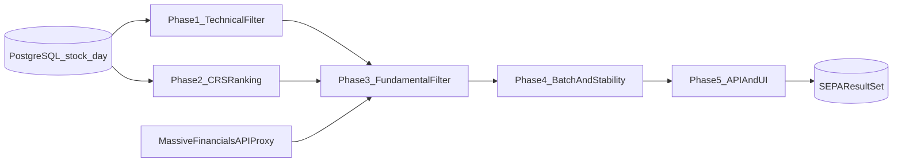

# SEPA 股票筛选实施方案（R-A8）

本文档将 R-A8 的分析结论整理为可执行的分阶段实施方案，用于指导后续开发排期与验收。需求定义见 [REQUIREMENTS.md](../REQUIREMENTS.md) §3.5.2，架构基线见 [ARCHITECTURE.md](../ARCHITECTURE.md) §2.10.10，能力现状见 [CAPABILITY_TRACKING.md](CAPABILITY_TRACKING.md)（#24）。

---

## 1. 背景与范围

- **目标**：实现基于 SEPA 方法论的股票筛选引擎，覆盖四个推进维度：计算、CRS 排名、批量效率、API 与前端页面。
- **当前基础**：
  - 技术面数据可用：`stock_day`（OHLCV，含 volume）。
  - 基本面数据可用：Massive financials（`/vX/reference/financials` 代理接口，含 EPS/Revenue 关键字段）。
- **范围边界**：
  - 本方案面向 Research 研究链路与候选池管理。
  - 筛选结果不进入 ExecutionGuard 或自动下单判定链路。

---

## 2. 总体架构与数据流（Phase 视角）

---

## 3. Phase 1：技术面计算 MVP

### 3.1 目标

- 跑通纯技术面筛选，输出逐条件命中结果与总体通过状态。
- 条件覆盖：SMA(50/150/200)、52 周高低点区间、50 日均量、价格相对均线等基础项。

### 3.2 输入 / 输出

- **输入**：ticker 集合、as-of 交易日、技术面阈值配置。
- **输出**：
  - 每个 ticker 的条件明细（pass/fail + actual + threshold）。
  - `technical_pass` 与候选集列表。

### 3.3 验收标准（DoD）

- 同一输入在同一数据快照下结果一致（可复现）。
- 输出字段稳定，前端可直接消费并展示逐条件解释。
- 空值与缺失数据路径有明确标记（非 silent failure）。

### 3.4 主要风险与降级

- **风险**：历史覆盖不足导致 SMA/52 周计算不完整。
- **降级**：该 ticker 标记 `insufficient_data`，不阻塞整批任务。

---

## 4. Phase 2：CRS 排名模块

### 4.1 目标

- 新增 CRS（非 RSI）百分位排名能力，作为 SEPA 核心条件之一。

### 4.2 关键约束

- 固化 Universe 口径（活跃股票范围、最低流动性、数据完整性）。
- 固化版本号（如 `crs_v1`），支持后续算法演进对比。
- 排名可复现（同 as-of 日期、同 universe、同输入得到同排名）。

### 4.3 验收标准（DoD）

- 可输出 `crs_score`、`universe_size`、`as_of_date`、`version`。
- 支持阈值筛选（如 `CRS >= 70`）。
- 与技术指标 RSI 在接口与说明中明确区分。

### 4.4 主要风险与降级

- **风险**：universe 漂移导致排名不可比。
- **降级**：当日冻结 universe 快照并在结果中回写 universe 元信息。

---

## 5. Phase 3：基本面复筛（EPS/Revenue）

### 5.1 目标

- 在候选集上接入基本面二级筛选：Q2Q 增长、加速、3Y 增长、FY 加速。

### 5.2 输入 / 输出

- **输入**：Phase 1+2 候选集、financials 数据（quarterly/annual）。
- **输出**：
  - 每个 ticker 的 EPS/Revenue 条件明细与总体 `fundamental_pass`。
  - 综合 `overall_pass`（技术面 + CRS + 基本面）。

### 5.3 口径约束

- 明确 Q2Q/FY/3Y 计算口径与缺失值处理规则。
- 财报字段映射固定为 `basic_earnings_per_share` 与 `revenues`（可扩展 diluted EPS）。

### 5.4 验收标准（DoD）

- 二级条件可解释、可回溯（来源期次、计算过程可追踪）。
- 外部数据失败不影响全量任务完成（ticker 级错误隔离）。

### 5.5 主要风险与降级

- **风险**：财报字段缺失、时间对齐不一致。
- **降级**：ticker 级标记 `fundamental_unavailable`，并保留技术面结果。

---

## 6. Phase 4：批量效率与稳定性

### 6.1 目标

- 建立两阶段漏斗与批量任务稳定性机制，满足大规模筛选可运行性。

### 6.2 关键策略

- 先技术面过滤，后基本面调用（减少外部请求总量）。
- 受控并发、限流与指数退避（429/5xx）。
- 可选缓存层（后续可演进为 `stock_financials` 落库缓存）。

### 6.3 验收标准（DoD）

- 批量任务可在可接受时延内完成（定义统一 SLO）。
- API 异常可恢复，任务具备重试与失败统计。
- 运行过程可观测（进度、失败率、耗时分布）。

### 6.4 主要风险与降级

- **风险**：外部 API 抖动导致任务堆积。
- **降级**：限制并发 + 分批执行 + 缓存命中优先。

---

## 7. Phase 5：API 与前端页面

### 7.1 目标

- 对外提供筛选任务接口与结果展示页面，形成端到端能力。

### 7.2 API 范围（规划）

- 任务触发（run）
- 进度查询（job status）
- 结果查询（分页、排序、过滤）
- 条件命中明细（逐 ticker explain）

### 7.3 前端页面范围（规划）

- 参数配置区（阈值、universe、as-of）
- 任务状态与进度
- 结果表（overall/technical/fundamental/CRS）
- 行级详情（逐条件 pass/fail + actual/threshold）

### 7.4 验收标准（DoD）

- 前后端字段契约一致。
- 页面可完成“配置 -> 运行 -> 查看结果 -> 查看明细”的完整闭环。
- 异常状态有可读错误信息与重试入口。

---

## 8. 阶段里程碑与验收清单

- **M1（Phase 1 完成）**：技术面可复现筛选 + 明细输出。
- **M2（Phase 2 完成）**：CRS 排名可复现 + 阈值过滤。
- **M3（Phase 3 完成）**：二级基本面条件可解释 + 回溯。
- **M4（Phase 4 完成）**：批量执行稳定，异常可恢复。
- **M5（Phase 5 完成）**：端到端可用（API + 页面 + 明细）。

---

## 9. 后续扩展（非本轮）

- `stock_financials` 持久化缓存与周期刷新。
- 每日筛选快照、历史对比与榜单变化追踪。
- CRS 多版本算法并行（v1/v2）与效果对比。

