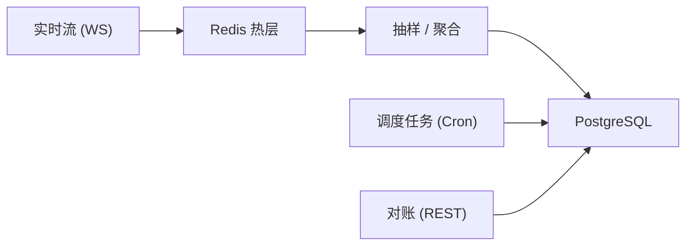
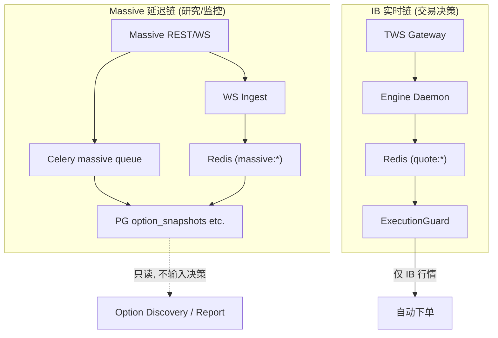
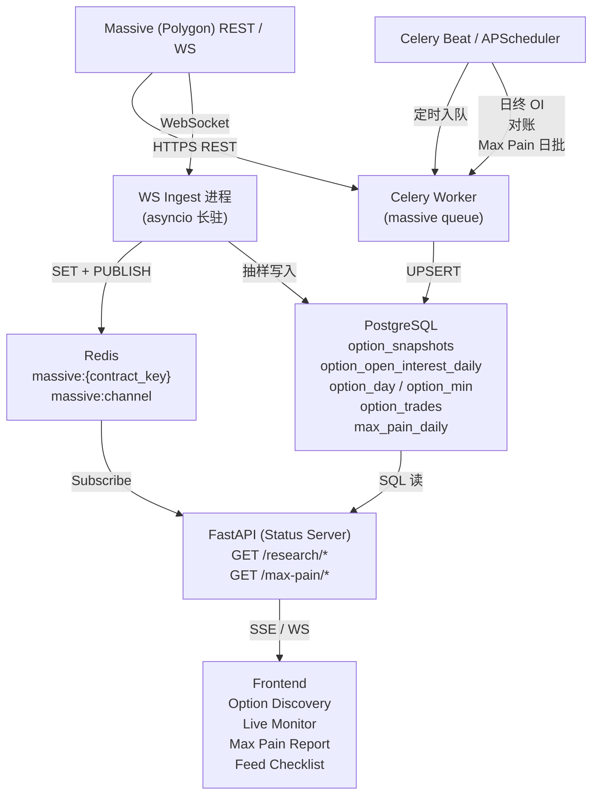

# Option Feed 落地架构与研究

本文档将期权 Massive（Polygon）数据 Feed 的**业界通用做法**与本项目现状做对照，形成可落地的架构决策。所有分项实施计划（库表、WS、Worker、API、UI、Max Pain）均以本文为理论依据。

**上位文档**：[ARCHITECTURE.md](../../ARCHITECTURE.md) §2.10。  
**索引**：[README.md](README.md)。

---

## 1. 业界三层数据模型

期权数据平台通常将数据按**质量与用途**分为三层：

| 层次 | 别名 | 特征 | 本项目对应 |
|------|------|------|------------|
| **Raw / Bronze** | 原始事件层 | 供应商原始 JSON/消息，append-only，按 vendor event ID 去重，便于审计与重放 | 当前无独立 raw 层；`_apply_snapshot` 直接写 Silver |
| **Canonical / Silver** | 规范业务层 | 统一键（`contract_key`）、统一时区、字段口径标准化 | `option_contracts`、`option_snapshots`、`option_open_interest_daily`、`option_trades`、`option_day/min` |
| **Serving / Gold** | 面向产品/报表 | 低延迟读取、聚合视图、特征表 | 当前仅 `DISTINCT ON` 取最新行；无物化视图或日批聚合 |

### 决策

- **Bronze 层为可选**：Starter 调用量不高，短期可不建；若 Developer 上量或接入 Flat File，建议在 PG 或对象存储保留原始响应（带 `ingest_batch_id`），用于纠错与回放。
- **Silver 层已基本就绪**：现有 §2.16 表覆盖合约、快照、OI、trades、K 线。
- **Gold 层待建**：Max Pain 日批、OI by strike 汇总、IV surface 快照等属于此层。

---

## 2. 读取、存储与持续更新

### 2.1 REST 的角色

- **回填与补洞**：历史 K 线、日终 OI、reference、corporate actions——批量、可重试、幂等（UPSERT on vendor unique key）。
- **按需快照**：链/合约 snapshot——适合低频或冷启动；与 UI 强交互时需配合**服务端缓存**或**任务合并**，避免重复打 API。
- **对账**：定时用 REST 拉取「权威区间」与本地比对，修补 WS 断线或丢包造成的缺口。

### 2.2 WebSocket 的角色

- **持续增量**：quotes / trades / aggregates——只负责「新」，不负责长期真相。
- **热层**：写入 Redis 最新态（按 `contract_key`），短 TTL；前端通过 SSE/WS 从 Server 转发（密钥不出浏览器）。
- **持久化**：全量落 PG 成本高；常见做法是 Redis 热 + 分钟级抽样落 PG，EOD 再以 REST 校准。

### 2.3 保持更新的三种机制

1. **实时流**：WS → Redis → 周期性或批量刷 PG。
2. **调度任务**：按交易日历跑 EOD OI、日滚、corporate actions。
3. **对账（reconciliation）**：定时 REST 拉「权威区间」与本地比对，修 gap（WS 断线/丢包时尤其重要）。

---

## 3. 与 IB 实盘链路的隔离边界

**核心规则**（引自 §2.10）：

- Massive 数据**延迟 15 分钟**（Starter）。全链路标注 `15m delay`。
- **禁止**将 Massive 数据输入 ExecutionGuard 或自动下单决策——仅 IB 实盘行情可进入交易决策链路。
- Massive 与 IB 在 Redis 中使用不同的 key 前缀（`massive:*` vs `quote:*`），避免命名空间冲突。

---

## 4. 数据流全景

---

## 5. 产品依赖关系

| 产品 | 主要数据消费层 | 关键输入 |
|------|----------------|----------|
| **Option Discovery** | Silver（截面快照 + 轻历史） | `option_snapshots` 最新行、expirations/strikes from REST |
| **Contract Live Monitor** | 热层（Redis 最新态 + SSE 推送） | WS ingest → Redis → SSE/WS 转发 |
| **Max Pain Report** | Gold（日批聚合） | `option_open_interest_daily` + 标的收盘价 → `max_pain_daily` |
| **Feed Checklist** | 元数据 / 质量指标 | `job_massive_backfill` 完成率、OI 覆盖率、snapshot 新鲜度 |

---

## 6. 非目标

- 本套件**不涉及** IB 实盘行情采集或 Engine 下单逻辑。
- 本套件**不涉及** Massive Business tier 特有功能（FMV 等），仅在 WS 计划中做 tier 兼容占位。
- 本套件**不修改** [REQUIREMENTS.md](../../REQUIREMENTS.md) 需求条文。
