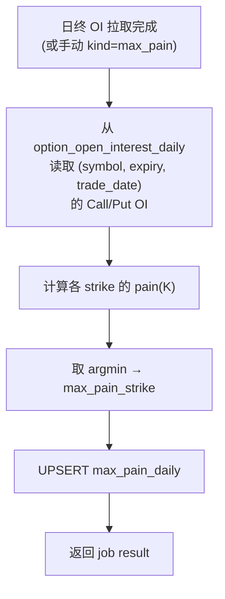

# Max Pain 报表设计方案

期权 Max Pain 分析报表的计算口径、数据依赖、API 形状、前端展示与免责声明。

**前置阅读**：[ARCHITECTURE_AND_RESEARCH.md](ARCHITECTURE_AND_RESEARCH.md) §5、[DATABASE_PLAN.md](DATABASE_PLAN.md) §2.3。  
**索引**：[README.md](README.md)。

---

## 1. 什么是 Max Pain

**Max Pain**（最大痛点）是指某到期日下，使**期权买方（持有者）总损失最大**（或等价地，使**期权卖方（Writer）总利润最大**）的标的收盘价。它基于一个假设：大部分期权在到期时会到价外（OTM），因此卖方整体获利最大的价格即为 Max Pain。

Max Pain 在业界常作为一种参考指标，观察标的价格在到期前是否有「向 Max Pain 收敛」的趋势（"pinning"）。**注意**：Max Pain 并非交易信号，不应作为自动下单决策的唯一依据。

---

## 2. 计算口径

### 2.1 输入

| 数据 | 来源 | 说明 |
|------|------|------|
| **各 strike 的 Call OI** | `option_open_interest_daily` WHERE `option_right='C'` | 日终 Open Interest |
| **各 strike 的 Put OI** | `option_open_interest_daily` WHERE `option_right='P'` | 日终 Open Interest |
| **行权价列表** | 上述 OI 行的 `strike` 集合 | 合并 Call 与 Put |
| **标的收盘价**（可选） | `stock_day` 或 Massive 日 K | 用于标注 Max Pain 与当前价的距离 |

### 2.2 算法

对到期日 E 的每个候选行权价 K：

```
pain(K) = Σ_i [ Call_OI(i) × max(0, i - K) × 100 ]
        + Σ_j [ Put_OI(j)  × max(0, K - j) × 100 ]
```

其中 i 遍历所有 Call 的 strike，j 遍历所有 Put 的 strike；乘以 100 是美股标准合约乘数（若有非标合约需查 `option_contracts` 或 `massive_corporate_action`）。

**Max Pain strike** = `argmin_K pain(K)`，即使买方总损失最大的那个 K。

### 2.3 注意事项

- OI 数据质量是前提——若某 strike 缺 OI，结果会偏差。日粒度 Checklist（[UI_CHECKLIST_AND_BACKFILL.md](UI_CHECKLIST_AND_BACKFILL.md)）可帮助发现 OI 缺口。
- 公司行动（拆股、特殊股息）可能导致 strike 调整或合约乘数变化。计算前应检查 `massive_corporate_action` 是否有近期行动，并在报表中标注。
- Max Pain 是日终静态指标（基于 EOD OI），不是实时值。

---

## 3. 数据表：`max_pain_daily`

详见 [DATABASE_PLAN.md](DATABASE_PLAN.md) §2.3。核心列：

| 列 | 说明 |
|----|------|
| `symbol` | 标的 |
| `expiry` | 到期 |
| `trade_date` | OI 截止日 |
| `max_pain_strike` | Max Pain 行权价 |
| `underlying_close` | 标的收盘价（可空） |
| `total_oi` | 该到期日 OI 合计 |
| `computation_detail` | 各 strike 的 pain value（JSONB，便于前端 drill-down） |

---

## 4. 计算流程（Worker）



- **触发**：日终 OI 拉取 job 完成后自动链式触发（Celery chain），或手动 `POST /research/massive/sync kind=max_pain`。
- **范围**：对 Watchlist 标的 × 每个到期日（距今 7–90 天内）计算。
- **幂等**：`UNIQUE(symbol, expiry, trade_date, source)` + UPSERT。

---

## 5. API

| 路由 | 方法 | 参数 | 返回 |
|------|------|------|------|
| `GET /research/max-pain` | GET | `symbol`（必填）、`expiry`（可选）、`trade_date_gte`、`trade_date_lte`、`limit`（默认 30） | `max_pain_daily` 行列表 |
| `GET /research/max-pain/latest` | GET | `symbol`（必填）、`expiry`（可选） | 最新交易日的 max pain 行（快捷） |

响应示例：

```json
{
  "rows": [
    {
      "symbol": "NVDA",
      "expiry": "20260417",
      "trade_date": "2026-03-21",
      "max_pain_strike": 120.0,
      "underlying_close": 118.5,
      "total_oi": 52340,
      "computation_detail": [
        { "strike": 110, "call_oi": 1200, "put_oi": 800, "pain": 584000 },
        { "strike": 115, "call_oi": 2100, "put_oi": 1500, "pain": 423000 },
        { "strike": 120, "call_oi": 3000, "put_oi": 2800, "pain": 312000 }
      ]
    }
  ]
}
```

---

## 6. 前端展示

### 6.1 位置

**Research → Max Pain**（新增子 tab 或独立页面，从 Research 导航进入）。

### 6.2 布局

- **标的选择器**：Watchlist STK 标的。
- **到期选择器**：该标的的到期日列表。
- **Max Pain 卡片**：显示 `max_pain_strike`、`underlying_close`、距离（`|close - max_pain| / close`）、`total_oi`。
- **Pain by Strike 图表**：X 轴 = strike，Y 轴 = pain value；标注 Max Pain strike（最低点）和当前标的价格线。可用柱状图或面积图。
- **历史趋势（可选）**：X 轴 = trade_date，Y 轴 = Max Pain strike + underlying close，观察 pinning 趋势。

### 6.3 文案示例（英文）

- 卡片标题：`Max Pain Analysis`
- 副标题：`Based on end-of-day open interest from Massive (15 min delayed source)`
- 到期选择：`Expiration`
- 图表标题：`Pain by Strike`
- 趋势图标题：`Max Pain vs Underlying (daily)`

---

## 7. 免责声明

在 Max Pain 页面底部或卡片内显示（英文）：

> **Disclaimer**: Max Pain is a theoretical reference metric based on end-of-day open interest data. It does not predict future price movement and should not be used as the sole basis for trading decisions. Open interest data is sourced from Massive (Polygon) with approximately 15-minute delay. Corporate actions (splits, special dividends) may affect strike prices and contract multipliers.

---

## 8. Owner 决策（已锁定）

| 编号 | 决策 |
|------|------|
| MP-1 | **API 层实时计算**：`GET /research/max-pain/compute` 与 `GET /research/max-pain/compute/history` 从 `option_open_interest_daily`（及 `stock_day`）现算 pain 曲线与历史序列；**不依赖** `report_option_max_pain_daily` 中已存的 `computation_detail` 做展示。（Celery `kind=max_pain` 仍可写表供其他用途，与 UI 解耦。） |
| MP-2 | **嵌入 Option Discovery**：`OptionDiscoveryMaxPainPanel`（在「By expiration – Option quotes」区块之上）。 |
| MP-3 | **V1 实现历史趋势**：`compute/history` + 「Max Pain vs underlying (daily)」折线。 |
| MP-4 | **需要**：复选框 **Pain by strike / Call OI bars / Put OI bars / Historical trend**，按勾选动态显示对应图层。 |
