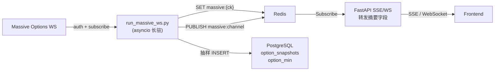

# WebSocket 落地方案

Massive（Polygon）Options WebSocket 长驻 ingest 进程的设计与落地方案。对齐 [ARCHITECTURE.md](../../ARCHITECTURE.md) §2.10.2 行为约定。

**前置阅读**：[ARCHITECTURE_AND_RESEARCH.md](ARCHITECTURE_AND_RESEARCH.md) §2.2。  
**索引**：[README.md](README.md)。

---

## 1. 现状

- 已有验证脚本 `scripts/verify_massive_options_ws.py`，可连接 Massive WS 并打印消息。
- Feed Massive Option 页面的 WS 能力（Aggregates Per Second/Minute、Quotes、Trades、FMV）均为 `partial` 状态——仅可通过 CLI 验证，无持久化或前端推送。
- 架构 §2.10 已规划「独立 asyncio 长驻进程 → Redis → SSE/WS 推前端」，尚未实现。

---

## 2. 目标架构

---

## 3. 进程设计：`scripts/run_massive_ws.py`

### 3.1 启动与配置

- 读取 `config.yaml` 中 `massive.api_key`、`massive.ws_url`（默认官方 delayed endpoint）、`massive.tier`。
- 接受 CLI 参数：`--channels`（逗号分隔，默认 `Q.O:*`）、`--config`、`--log-level`。
- 与 Celery / Status Server 可同机不同进程并行，无共享状态（仅通过 Redis 通信）。

### 3.2 连接管理

| 环节 | 策略 |
|------|------|
| 认证 | 连接后发送 `{"action":"auth","params":"API_KEY"}`；校验 `auth_success` |
| 订阅 | 认证成功后发送 `{"action":"subscribe","params":"Q.O:*,AM.O:*"}`；Starter 不订阅 Trades |
| 心跳 | Massive WS 有 server ping；客户端检测 30s 无消息视为异常 |
| 重连 | 指数退避：1s → 2s → 4s → … → 60s 上限；重连后重新 auth + subscribe |
| 背压 | 内部 asyncio.Queue 上限 10000 条；溢出时 drop oldest + 计数告警 |

### 3.3 消息处理

每条消息解析后：

1. **写 Redis**：`SET massive:{contract_key} {JSON}` + `EXPIRE 300`；`PUBLISH massive:channel {contract_key}`。
2. **抽样落 PG**（可选）：每合约每分钟最多写一行 `option_snapshots`（source='massive_ws'）或 `option_min`。
3. **指标更新**：内存计数器 `messages_received`、`messages_persisted`、`reconnects`。

### 3.4 Starter vs Developer 通道

| 通道前缀 | 说明 | Starter | Developer |
|-----------|------|---------|-----------|
| `Q.O:` | BBO Quotes | 可订阅（delayed） | 可订阅 |
| `AM.O:` | Per-Minute Aggs | 可订阅 | 可订阅 |
| `A.O:` | Per-Second Aggs | 可订阅 | 可订阅 |
| `T.O:` | Trades | 不订阅 | `trades_enabled` 时订阅 |
| `FMV.O:` | Fair Market Value | 不订阅 | Business tier |

配置驱动：读 `massive.tier` 与 `massive.features.trades_enabled` 决定订阅列表。

---

## 4. Redis Key 约定

| Key 模式 | 类型 | TTL | 说明 |
|----------|------|-----|------|
| `massive:{contract_key}` | STRING (JSON) | 300s | 最新 quote/agg 数据 |
| `massive:meta:subscriptions` | SET | 无 | 当前已订阅的通道列表 |
| `massive:meta:status` | HASH | 无 | `last_msg_ts`、`connected`、`reconnects` |
| `massive:channel` | Pub/Sub channel | N/A | 有新数据时 PUBLISH contract_key |

与 IB 行情 key `quote:{symbol}` 完全分离。

---

## 5. REST Gap-Fill

WS 断线期间的数据缺口通过 REST 补齐：

1. 记录断线时刻 `disconnect_ts` 与重连时刻 `reconnect_ts`。
2. 重连成功后，对活跃订阅合约调用 REST snapshot（chain 或 contract level）补写 PG。
3. Gap-fill 请求通过现有 `POST /research/massive/sync` 入队 Celery，避免 ingest 进程直接做 HTTP。

---

## 6. 失败降级

若 WS ingest 进程不可用（未启动、崩溃、Massive WS 不可达）：

- **Option Discovery** 与 **Max Pain** 仍走 REST + Celery 路径，功能不受影响。
- **Live Monitor** 降级为「无实时推送」，前端展示 stale 提示并可手动触发 REST snapshot 刷新。
- Status Server 通过 `massive:meta:status` 检测 WS 是否在线，暴露 `/research/massive/ws-status` 端点。

---

## 7. 监控指标

| 指标 | 来源 | 告警阈值 |
|------|------|----------|
| `ws_connected` | `massive:meta:status` | 0 = 断线 |
| `ws_last_msg_age_s` | now() - `last_msg_ts` | > 60s（交易时段） |
| `ws_reconnects_total` | 累计重连次数 | 单日 > 10 |
| `ws_messages_per_min` | 滑动窗口 | 交易时段 = 0 需告警 |
| `ws_queue_depth` | asyncio.Queue.qsize() | > 5000 |

---

## 8. 部署

- 启动命令：`python scripts/run_massive_ws.py --config config/config.yaml`。
- 可选 systemd unit（与 `bifrost-celery-massive.service` 同级）。
- 与 Status Server、Celery massive worker **同机不同进程**即可；仅通过 Redis 通信。

---

## 9. 决策记录（已锁定）

| 编号 | 问题 | 决策 |
|------|------|------|
| WS-1 | 订阅范围 | **按 Watchlist 标的动态订阅**——每 60s 轮询 Watchlist STK (optionable=true) 并增量 subscribe/unsubscribe |
| WS-2 | 抽样落 PG 粒度 | **1 分钟 + EOD REST 校准**——AM.O: 每合约每分钟最多一行 `option_snapshots (source='massive_ws')`；日终由 Celery cron REST 补齐缺口 |
| WS-3 | 进程形式 | **独立长驻进程** `scripts/run_massive_ws.py`——与 Daemon 同级别服务，systemd unit `bifrost-massive-ws.service` |
