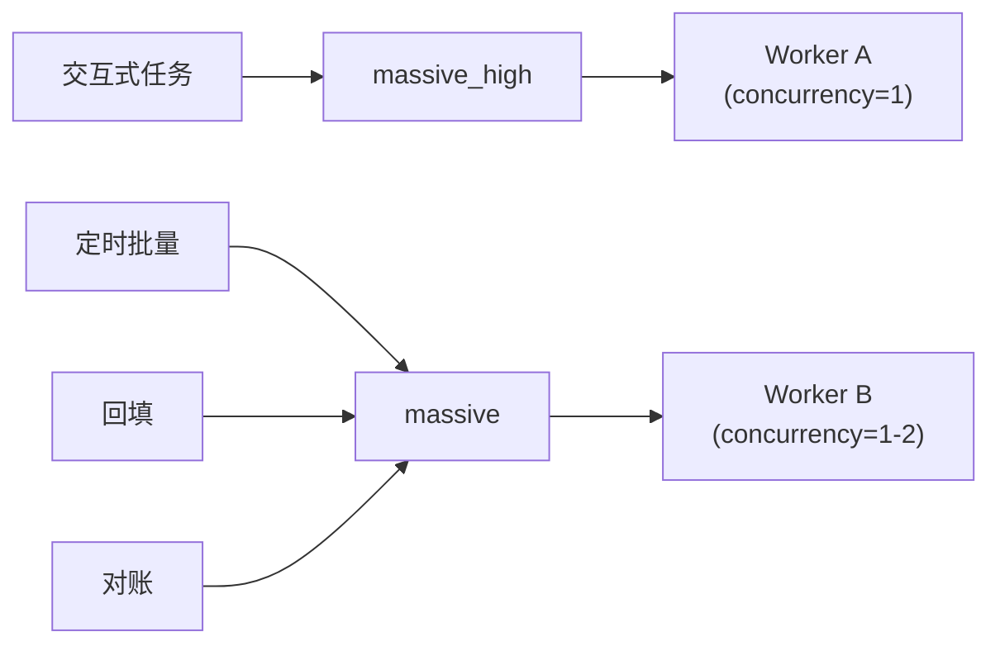

# Worker 扩展升级方案

Massive（Polygon）期权数据 Celery Worker 的队列隔离、调度策略、任务去重与对账方案。基于现有 `massive` 队列与 `job_massive_backfill` 表。

**前置阅读**：[ARCHITECTURE_AND_RESEARCH.md](ARCHITECTURE_AND_RESEARCH.md) §2.1。  
**索引**：[README.md](README.md)。

---

## 1. 现状

- 已有 Celery `massive` 队列，与 IB `bars` 队列分离。
- `servers/massive_tasks.py` 实现 `run_massive_job`：支持 `snapshot`、`aggregates`、`oi`、`trades`、`reference`、`corporate_action` 等 kind。
- `job_massive_backfill` 表管理任务状态（pending → running → done/failed）。
- 幂等写入（UPSERT on vendor unique key）已实现。
- **尚未实现**：定时调度（cron）、任务去重、对账、优先级隔离。

---

## 2. 任务分类

| 类别 | 触发方式 | 示例 | 延迟要求 | 说明 |
|------|----------|------|----------|------|
| **交互式** | 用户点击 / API 调用 | Option Discovery Load quotes、单合约 snapshot | 低（< 10s 可感知） | 优先级最高 |
| **定时批量** | Cron / Celery Beat | 日终 OI 拉取、corporate action 同步、Max Pain 日批 | 宽松（交易日结束后） | 可排队 |
| **回填** | 手动触发 | 历史 K 线、大范围 OI 补洞 | 宽松 | 可排队，量大 |
| **对账** | Cron | 每日对比供应商摘要 vs 本地计数 | 宽松 | 只读 + 告警 |

---

## 3. 队列隔离方案

- **`massive_high`**：交互式 snapshot（由 `POST /research/massive/sync` 带 `priority=high` 入队时路由）。
- **`massive`**（默认）：cron、backfill、对账。
- 两个 Worker 可同进程 `-Q massive_high,massive` 但 `massive_high` 优先消费；或拆成两个进程分别专注。

---

## 4. 定时调度设计

推荐使用 **Celery Beat**（与现有 Celery 架构一致）或 **APScheduler**。调度配置放在 `config.yaml` 的 `massive.schedules` 下。

| 任务 | 周期 | 执行条件 | 目标表 |
|------|------|----------|--------|
| **日终 OI 拉取** | 每交易日 17:00 ET | 美股交易日（参考 `reference_us_holidays`） | `option_open_interest_daily` |
| **Max Pain 日批** | 日终 OI 完成后 | OI 拉取 job done | `max_pain_daily` |
| **Corporate action 同步** | 每交易日 18:00 ET | Watchlist 标的 | `massive_corporate_action` |
| **日级对账** | 每交易日 20:00 ET | 无 | 告警日志 / 元数据表 |
| **Job trim** | 每日 02:00 | 无 | `job_massive_backfill` 保留最近 500 |

### 4.1 交易日历

复用现有 `reference_us_holidays` 表判断当日是否交易日。Celery Beat 每天触发 → task 内部检查是否交易日 → 非交易日 skip 并记录。

---

## 5. 任务去重

### 5.1 入队时防重

在 `POST /research/massive/sync` 入队前：

1. 计算 `payload_hash = SHA256(canonical_json(kind + sorted_payload))`。
2. 查询 `job_massive_backfill` 是否存在 `status IN ('pending','running') AND payload_hash = ?`。
3. 若存在，返回已有 `job_id`（前端轮询同一 job），不再 INSERT。

### 5.2 短 TTL 缓存

对于 snapshot 类任务，在 Redis 设 `massive:job_dedup:{payload_hash}` TTL 60s。入队前先 `SET NX`，命中则直接返回。

---

## 6. 退避与限流

| 场景 | 策略 |
|------|------|
| Massive 返回 429 | 指数退避：2s → 4s → 8s → … → 120s；已实现于 `massive_tasks.py` |
| Massive 返回 5xx | 同上 + 最多重试 3 次后 fail |
| 请求间隔 | 即使无 429，每次 REST 请求间保留 200ms 间隔 |
| Celery retry | `self.retry(countdown=backoff, max_retries=5)` |

---

## 7. 对账任务

每日对账任务流程：

1. 对 Watchlist 中的 STK 标的，调用 Massive REST 获取「某日期 chain snapshot 合约数」。
2. 与本地 `option_open_interest_daily` 或 `option_snapshots` 该标的/日期行数对比。
3. 差异超过阈值（如 > 5%）时写入告警日志 + 可选 `massive_reconciliation_log` 表。
4. 前端 Feed Checklist 展示对账结果（pass / warn / fail）。

---

## 8. 与现有代码对齐

| 现有 | 本计划扩展 |
|------|------------|
| `servers/massive_tasks.py: run_massive_job` | 新增 `kind=max_pain`、`kind=reconcile` 分支 |
| `servers/celery_app.py` | 注册 `massive_high` 队列；配置 Beat schedule |
| `job_massive_backfill` 表 | 新增 `payload_hash` 列 + partial unique index |
| `POST /research/massive/sync` | 增加去重逻辑与可选 `priority` 参数 |

---

## 9. 决策记录（已锁定）

| 编号 | 问题 | 决策 |
|------|------|------|
| WK-1 | 调度器 | **Celery Beat**——`servers/celery_app.py` 中 `beat_schedule`；启动脚本 **[scripts/run_celery_beat.py](../../scripts/run_celery_beat.py)** |
| WK-2 | 日终 OI 范围 | **仅 Watchlist**（`sec_type=STK` 且 `optionable=true` 的 distinct `symbol`）；全量市场链路过大，不启用 |
| WK-3 | 对账告警 | **标准日志**（`logger.warning` / `logger.info`）+ Celery → Redis Stream → 监控 UI Console；**不新增**专用 DB 表；对账与 trim 等结果同时写入 `job_massive_backfill.result`（JSON）便于 API/轮询查看 |

**Beat 默认 UTC 时刻（可在 `celery_app.py` 调整）**：22:00 `eod_pipeline`；22:45 `reconcile`；23:00 `corporate_action`（Watchlist）；02:15 `trim_jobs`。与美东收盘对齐时请按夏令时自行微调小时数。
