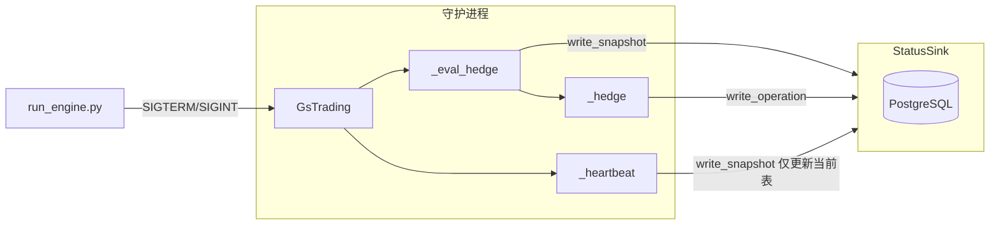

# 阶段 1 执行计划：状态 Sink + 最小控制

与 [分步推进计划](../PLAN_NEXT_STEPS.md) 阶段 1 及运行环境需求一致。实现 R-M1a、R-M4a、R-C1a、R-H1。

**数据库设计**：所有与 PostgreSQL 相关的表结构、写入策略及后续阶段扩展均以 [数据库设计（PostgreSQL）](../DATABASE.md) 为唯一说明，本文仅引用该文档。

**阶段 1 设计决策**（避免后续重构）：

- **存储**：采用 **PostgreSQL** 作为唯一 sink 实现（不做 SQLite），阶段 1 一步到位；需本地或 Docker 提供 PostgreSQL。
- **写入策略**：**当前表**在每次 **heartbeat** 时更新，保证监控能读到最新状态；**历史表**仅在有意义时追加（如发生对冲相关操作时，或最多每心跳一条）；**操作表**仅在对冲意图/下单/成交/拒绝时写入。纯“无操作心跳”不向历史表追加，仅更新当前表，其余走应用日志。
- **控制文件**：**留给阶段 2**；阶段 1 只做 SIGTERM/SIGINT 信号停止（R-C1a 验收不包含控制文件）。

---

## 范围与成功标准

- **交付物**：(1) StatusSink 接口 + **PostgreSQLSink**（当前视图表 + 历史表 + 操作表）；(2) 守护程序按上述写入策略写 snapshot 与操作记录；(3) SIGTERM/SIGINT 触发优雅停止。控制文件由阶段 2 实现。
- **成功标准**：[分步推进计划](../PLAN_NEXT_STEPS.md) 中阶段 1 的全部 Test Case（TC-1-R-M1a-*、TC-1-R-M4a-*、TC-1-R-H1-*、TC-1-R-C1a-*）通过；R-C1a 仅验收信号停止。

## Todo List（阶段 1 执行清单）

完成一项勾选一项。

### 步骤 1：配置与接口

- [x] **1.1** 在 `config/config.yaml` 中增加 `status.sink: "postgres"` 及 PostgreSQL 连接配置（如 `status.postgres`：host、port、database、user、password 或 DSN）；必要时更新 `config.yaml.example`。
- [x] **1.2** 新建 `src/sink/` 包，定义抽象基类 `StatusSink`（`write_snapshot(snapshot: dict)`、`write_operation(record: dict)`），并约定 snapshot/operation 字段（见步骤 1 正文）。
- [x] **1.3** 在 `GsTrading.__init__` 中读取 `config.get("status", {})`；未配置 sink 时 `self._status_sink = None`。

### 步骤 2：PostgreSQLSink

- [x] **2.1** 实现 `PostgreSQLSink`：建表 `status_current`、`status_history`、`operations`（列与计划一致）；`write_snapshot(..., append_history: bool)` 更新当前表，仅在 `append_history=True` 时追加历史表；`write_operation` 插入操作表。处理连接与重连。
- [x] **2.2** 在 `src/sink/__init__.py` 中导出 `StatusSink`、`PostgreSQLSink`。

### 步骤 3：GsTrading 挂接快照（按写入策略）

- [x] **3.1** 在 `GsTrading.__init__` 中若 `status.sink == "postgres"` 且连接配置存在则创建 `PostgreSQLSink(...)` 并赋给 `self._status_sink`。
- [x] **3.2** 实现 `_build_snapshot_dict(snapshot, spot, cs, data_lag_ms)`，产出符合 R-M1a 的字典。
- [x] **3.3** **当前表**：在 **heartbeat** 循环内（每次 sleep 醒来后、调用 `_eval_hedge_sync` 前或后）若 sink 存在则调用 `write_snapshot(..., append_history=False)`，仅更新当前视图。**历史表**：仅在发生对冲相关操作时（见步骤 4）或可选每心跳一次调用 `write_snapshot(..., append_history=True)`；纯无操作心跳不追加历史。

### 步骤 4：操作记录写入

- [x] **4.1** 在 `apply_hedge_gates` 通过后、调用 `_hedge()` 前，写一条 `hedge_intent`/`target_emitted` 操作记录；此时可顺带 `write_snapshot(..., append_history=True)`。
- [x] **4.2** 在纸/实盘“订单发出”处写 `order_sent`；在 `on_full_fill` 处写 `fill`；在 `on_ack_reject` 处写 `reject`。

### 步骤 5：信号停止

- [x] **5.1** 重构 `run_daemon`：在内部 `async def _main()` 中创建 app、获取 loop、注册 SIGTERM/SIGINT 调用 `loop.call_soon_threadsafe(app.stop)`，再 `await app.run()`；入口为 `asyncio.run(_main())`。

### 步骤 6：控制文件

- **留给阶段 2**：本阶段不实现。阶段 2 独立应用通过 POST /control/stop 写控制文件或调 API。

### 步骤 7：文档与验收

- [x] **7.1** 在 README 或 docs 中增加：阶段 1 依赖 PostgreSQL；`status.sink`、`status.postgres` 配置说明；用 psql 或脚本查看 `status_current`/`operations` 的示例。
- [ ] **7.2** 按分步计划阶段 1「检查方式」与「本阶段 Test Case 清单」执行验收，确认全部 TC-1-* 通过（R-C1a 仅验收信号停止）。

---

## 阶段 1 自检脚本

运行自检可验证配置、Sink 接口、PostgreSQL 表结构、**运行环境（IB 连通性）**与可选信号停止，满足阶段 1 验收要求。与 [PLAN_NEXT_STEPS.md](../PLAN_NEXT_STEPS.md) 阶段 1 Test Case 清单及「运行环境验证」对应。

**脚本**：[scripts/check/phase1.py](../../scripts/check/phase1.py)

**用法**（在项目根目录执行）：

```bash
# 完整自检（含 Config、Sink、PostgreSQL、IB、可选 Signal）
# 默认执行 IB 连接检查，需 TWS/Gateway 已启动
python scripts/check/phase1.py

# 无 TWS 时跳过 IB 检查（如 CI 或仅验配置）
python scripts/check/phase1.py --skip-ib

# 仅检查配置与 Sink 接口（无需 PostgreSQL）
python scripts/check/phase1.py --skip-db --skip-ib

# 含信号测试：启动守护进程、发 SIGTERM、断言数秒内退出（需可运行环境）
python scripts/check/phase1.py --signal-test
```

**检查项与 TC 对应**：

| 自检项 | 对应 Test Case / 说明 |
|--------|------------------------|
| Config (status.sink + postgres) | TC-1-R-H1-3 |
| Sink interface (SNAPSHOT/OPERATION keys) | TC-1-R-M1a-3、TC-1-R-M4a-2 |
| PostgreSQL schema (tables + columns) | TC-1-R-M1a-2、TC-1-R-M4a-3、TC-1-R-H1-1 |
| IB TWS/Gateway connect | **运行环境验证**（阶段 1 引入）；默认执行，`--skip-ib` 可跳过 |
| SIGTERM → daemon exit | TC-1-R-C1a-1；可选，`--signal-test` 时执行 |

**运行环境验证**：阶段 1 在「状态 sink + 最小控制」之外，于本环节正式引入并验收运行环境——PostgreSQL 表结构 + **IB TWS/Gateway 连通性**（项目已包含 IB 连接代码）。自检脚本默认执行 IB 检查，建议在具备 TWS 的环境下执行完整自检；无 TWS 或 CI 时使用 `--skip-ib`。无 PostgreSQL 时使用 `--skip-db`；不测信号退出时省略 `--signal-test`。

---

## 当前代码锚点

| 关注点 | 位置 | 说明 |
|--------|------|------|
| 入口 | [scripts/run_engine.py](../../scripts/run_engine.py) | `run_daemon(config_path)`（内部 `asyncio.run(_run_daemon_main(...))`）；SIGTERM/SIGINT 已注册，调用 `app.stop()`。 |
| 守护进程主循环 | [src/app/gs_trading.py](../../src/app/gs_trading.py) | `run_daemon()` 加载配置、构建 `GsTrading`、`await app.run()`。`app.run()` 内设置 `self._loop = asyncio.get_running_loop()` 并执行 FSM 处理。 |
| 心跳 / 驱动 | [src/app/gs_trading.py](../../src/app/gs_trading.py) | `_heartbeat()` 若存在 sink 则先 `_refresh_and_build_snapshot()` 并 `write_snapshot(..., append_history=False)`，再 `_eval_hedge_sync()`。 |
| 快照数据来源 | [src/app/gs_trading.py](../../src/app/gs_trading.py)、[src/core/store.py](../../src/core/store.py)、[src/core/state/snapshot.py](../../src/core/state/snapshot.py) | `_refresh_and_build_snapshot()` 返回 `(StateSnapshot, spot, CompositeState, data_lag_ms)`。Store 提供股票持仓、spot、bid/ask、daily_hedge_count、daily_pnl、last_hedge_*、spread_pct。 |
| 对冲流程（操作事件） | [src/app/gs_trading.py](../../src/app/gs_trading.py) | `_eval_hedge`：在 `apply_hedge_gates` 通过后 `log_target_position`，再 `_fsm_trading.apply_transition(TARGET_EMITTED)` 并 `await self._hedge()`。`_hedge()`：纸交易路径打日志并调用 `on_order_placed` / `on_ack_ok` / `on_full_fill`；实盘路径 `place_order` 后走 `on_ack_ok`/`on_full_fill` 或 `on_ack_reject`。 |
| 配置加载 | [src/app/gs_trading.py](../../src/app/gs_trading.py) | `read_config()` 返回 `(config, path)`。config 为 dict；目前无 `status`、`control` 段。 |
| 停止 | [src/app/gs_trading.py](../../src/app/gs_trading.py) | `stop()` 调用 `self._fsm_daemon.request_stop()`。无进程外触发。 |

## 实施步骤

### 步骤 1：配置结构与 StatusSink 接口

- **配置**：在 [config/config.yaml](../../config/config.yaml)（及示例）中增加可选顶层 `status`，例如：
  - `status.sink`：`"postgres"`（阶段 1 仅实现 PostgreSQL）。
  - `status.postgres`：连接参数，如 `host`、`port`、`database`、`user`、`password`（或使用环境变量 / DSN）。
- **接口**：新建包 `src/sink/`：
  - 抽象基类 `StatusSink`，提供 `write_snapshot(snapshot: dict, append_history: bool = False) -> None` 与 `write_operation(record: dict) -> None`。snapshot / record 的字段形状见下（与 R-M1a / R-M4a 一致）。
  - Snapshot 字典（R-M1a 最少字段）：`daemon_state`、`trading_state`、`symbol`、`spot`、`bid`、`ask`、`net_delta`、`stock_position`、`option_legs_count`、`daily_hedge_count`、`daily_pnl`、`data_lag_ms`、`config_summary`（或等价）、`ts`。
  - 操作记录字典（R-M4a 最少）：`ts`、`type`（如 `hedge_intent` | `order_sent` | `fill` | `reject`/`cancel`）、`side`（BUY/SELL）、`quantity`、`price`（可选）、`state_reason`（如 D2/D3、block_reason）。
- **配置读取**：在 `GsTrading.__init__` 中读取 `config.get("status", {})`；若未配置 `status.sink` 或非 `postgres` 则不创建 sink（`self._status_sink = None`）。

### 步骤 2：PostgreSQLSink 实现（R-M1a、R-M4a、R-H1）

- **表结构**：以 [数据库设计](../DATABASE.md) 为准。摘要：
  - **当前视图**：表 `status_current`，仅保留一行“最新”快照（列见 DATABASE.md §2.1）；upsert 或 replace。
  - **历史表**：表 `status_history`，列与当前一致，可加自增 `id`；仅在 `append_history=True` 时追加（见 DATABASE.md §3）。R-H1：同一 sink 内同时支持“当前 + 历史”。
  - **操作表**：表 `operations`，列见 DATABASE.md §2.3（ts、type、side、quantity、price、state_reason 等）。
- **PostgreSQLSink**：实现 `StatusSink`；使用 psycopg2 或 asyncpg 连接 PostgreSQL；若表不存在则建表；`write_snapshot(snapshot, append_history)` 更新当前表，`append_history=True` 时追加历史表；`write_operation` 插入操作表。需处理连接与重连（仅从主循环调用时可使用同步驱动）。
- **写入策略**：调用方（GsTrading）负责区分：**当前表**每次 heartbeat 调用 `write_snapshot(..., append_history=False)`；**历史表**仅在发生对冲相关操作时（或可选每心跳一次）调用 `write_snapshot(..., append_history=True)`；**操作表**仅在对冲意图/下单/成交/拒绝时写入。纯无操作心跳不追加历史，仅更新当前表。

### 步骤 3：在 GsTrading 中挂接 sink（按写入策略）

- **创建 sink**：在 `GsTrading.__init__` 中，若 `config.get("status", {}).get("sink") == "postgres"` 且连接配置存在，则创建 `PostgreSQLSink(...)` 并保存为 `self._status_sink`；否则 `self._status_sink = None`。
- **构建快照字典**：新增辅助方法 `_build_snapshot_dict(snapshot, spot, cs, data_lag_ms)`，从 `self._fsm_daemon.current`、`self._fsm_trading.state`、`self.symbol`、store、cs 等组 dict；`ts = time.time()`。
- **写入时机**：**当前表**：在 **heartbeat** 循环内（每次睡眠醒来后），若 sink 存在则先刷新一次 snapshot（可调用 `_refresh_and_build_snapshot()` 或使用最近一次结果）并调用 `write_snapshot(dict, append_history=False)`。**历史表**：仅在步骤 4 的写入点（对冲意图、下单、成交、拒绝）或可选每心跳一次调用 `write_snapshot(..., append_history=True)`。不在每次 _eval_hedge 都写历史，避免无操作心跳灌满历史表。

### 步骤 4：操作记录写入（R-M4a）

- **写入点**（至少）：
  - **对冲意图 / 目标发出**：在 `apply_hedge_gates` 返回非 None 且尚未调用 `_hedge()` 时，写一条 type 为 `hedge_intent`（或 `target_emitted`），带 side、quantity、state_reason（来自 cs，如 D2/D3）。
  - **订单发出**：实际发送（纸或实盘）时，写 `order_sent`，带 side、quantity、price=spot。
  - **成交**：在 `on_full_fill` 时写 `fill`，带 side、quantity、price。
  - **拒绝**：在 `on_ack_reject` 时写 `reject`，带 side、quantity、可选 reason。
- **数据来源**：用 store/snapshot/cs 填 `state_reason`（如 `f"D{cs.D.value}"` 或 guard 的 block_reason）。以上均在 `_eval_hedge` 与 `_hedge` 中完成。

### 步骤 5：信号处理（R-C1a）

- **注册位置**：信号需在主线程注册，且需要 `app` 引用。调整 [scripts/run_engine.py](../../scripts/run_engine.py) 或 [src/app/gs_trading.py](../../src/app/gs_trading.py)：在异步入口内先加载配置并创建 `GsTrading`，再跑一个内部协程，在该协程内获取 loop、注册 SIGTERM/SIGINT、然后 `await app.run()`。
- **实现方式**：在 `run_daemon(config_path)` 中：`async def _main(): config, path = read_config(...); app = GsTrading(...); loop = asyncio.get_running_loop(); signal.signal(signal.SIGTERM, lambda s, f: loop.call_soon_threadsafe(app.stop)); signal.signal(signal.SIGINT, ...); await app.run()`，最后 `asyncio.run(_main())`。这样信号能安全触发 `app.stop()`，主循环优雅退出。
- **涉及文件**：在 gs_trading.py 的 `run_daemon` 中实现上述 `_main()` 并 `asyncio.run(_main())` 即可。

### 步骤 6：可选控制文件（1.3）

- **本阶段不实现**：控制文件轮询留给阶段 2；阶段 2 独立应用通过 POST /control/stop 写控制文件或调 API 触发停止。

### 步骤 7：文档与验收

- **README/docs**：说明阶段 1 依赖 PostgreSQL；`status.sink`、`status.postgres` 配置；用 psql 或脚本查询 `status_current`/`operations` 的示例。
- **验收清单**：按 [分步推进计划](../PLAN_NEXT_STEPS.md) 阶段 1「检查方式」与「本阶段 Test Case 清单」执行，确认全部 TC-1-* 通过（R-C1a 仅验收信号停止，不含控制文件）。

## 数据流（概念）



## 文件变更汇总

| 文件/路径 | 动作 |
|-----------|------|
| `config/config.yaml` | 增加 `status.sink: "postgres"` 及 `status.postgres`（host、port、database、user、password 等）。 |
| `src/sink/__init__.py` | 新建；导出 StatusSink、PostgreSQLSink。 |
| `src/sink/base.py`（或 `interface.py`） | 新建；抽象 StatusSink，含 write_snapshot(snapshot, append_history)、write_operation。 |
| `src/sink/postgres_sink.py` | 新建；PostgreSQLSink，含当前表、历史表、操作表；连接与重连。 |
| `src/app/gs_trading.py` | 按配置创建 PostgreSQLSink；_build_snapshot_dict；heartbeat 时 write_snapshot(append_history=False)；在对冲意图/下单/成交/拒绝处 write_operation 及可选 write_snapshot(append_history=True)。 |
| `scripts/run_engine.py` 或 `src/app/gs_trading.py` | 注册 SIGTERM/SIGINT 并线程安全调用 app.stop()；调整 run_daemon 使 loop 与 app 在注册时可用。 |
| [docs/DATABASE.md](../DATABASE.md) | 数据库设计唯一文档：连接配置、表结构、写入策略、后续阶段预留。 |
| `docs/PLAN_NEXT_STEPS.md` 或 README | 说明阶段 1 依赖 PostgreSQL；status 配置及用 psql 查看表；表结构见 DATABASE.md。 |

## 风险与缓解

- **PostgreSQL 依赖**：阶段 1 需本地或 Docker 提供 PostgreSQL；文档中写明并给出示例连接配置。
- **连接与重连**：PostgreSQLSink 需处理连接失败与重连；仅从主循环调用时可使用同步驱动（如 psycopg2）。
- **config 摘要体积**：保持较小（如 gates 的 hash 或关键键），避免快照行过大。
- **历史表膨胀**：按写入策略仅在有意义时追加；保留策略在阶段 3 再文档化。

## 阶段 1 不包含

- 阶段 2：独立应用、GET /status、GET /operations、POST /control/stop、红绿灯 status_lamp、自检 self_check。
- R-C3（一键平敞口）与 R-C1b（通过独立应用发停止）。
